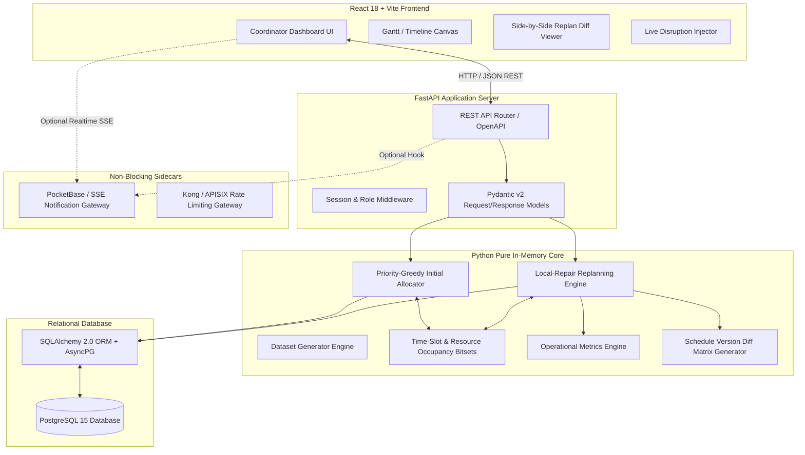
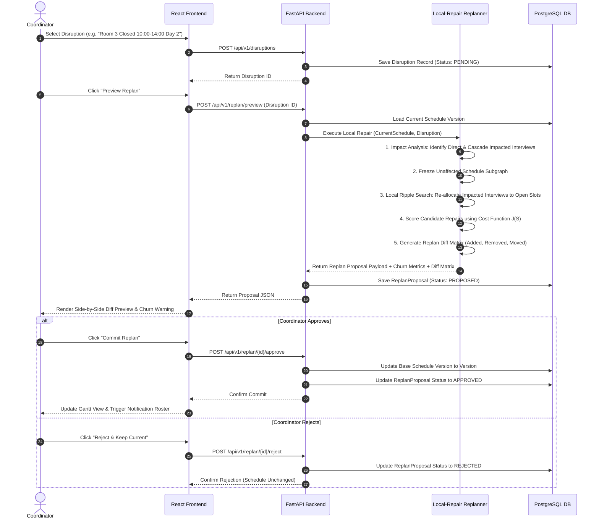

# System Architecture Specification

> **Document Version:** 1.0.0  
> **Status:** Approved Source of Truth  
> **Target System:** The Placement Week Scheduler

---

## 1. Executive Architectural Summary

**The Placement Week Scheduler** is designed as a **decoupled, modular, event-aware monolithic application** optimized for predictable execution, high performance under burst replanning, and absolute determinism.

Rather than over-engineering the system with microservices, distributed queues, or complex mesh proxies for a 1-week assessment, the core system relies on a high-throughput **Python Core Engine (FastAPI)** backed by **PostgreSQL** and an interactive **React + Vite Dashboard**.

Optional enterprise extensions (such as API Gateways or standalone Realtime Push Brokers) are strictly decoupled as non-blocking sidecars.

---

## 2. Layered Component Architecture

---

## 3. Component Breakdown

### 3.1 Presentation Layer (Frontend)
- **Technology:** React 18, Vite, TailwindCSS, Framer Motion, Lucide Icons.
- **Responsibilities:**
  - Render 20 rooms across 4 days (72 operating slots of 15-min intervals per room/day) in a fluid Gantt layout.
  - Provide real-time filtering by Branch, Company, Priority Tier, Student, or Room status.
  - Display live conflict drawer showing unscheduled interviews and constraint failure reasons.
  - Interactive **Disruption Injector**: UI controls for setting late hours, panel drops, student withdrawals, and room closures.
  - **Replan Diff Viewer**: Highlights added, removed, and shifted appointments with visual churn warnings before commitment.

### 3.2 API & Application Layer (Backend)
- **Technology:** Python 3.11+, FastAPI, Pydantic v2.
- **Responsibilities:**
  - Expose high-performance RESTful endpoints for dataset seeding, schedule generation, disruption submission, replan preview, replan commit, and metrics retrieval.
  - Convert database entities into flattened in-memory data structures optimized for fast bitset allocation.
  - Guarantee transaction isolation during schedule updates.

### 3.3 Core Domain Engine (In-Memory Core)
- **Technology:** Pure Python dataclasses, `bitarray` / integer bitmasks, min-heaps (`heapq`), network graph helpers.
- **Responsibilities:**
  - **Dataset Generator:** Builds realistic company, student, shortlist, room, and panel entities.
  - **Bitset Occupancy Registry:** Maps 4 days $\times$ 36 time slots (15-min increments from 09:00 to 18:00 = 144 discrete slots total per resource). Uses bitwise `AND` / `OR` for zero-overhead collision checks:
    $$\text{HasOverlap} = (\text{ResourceBitmask} \mathbin{\&} \text{InterviewBitmask}) \ne 0$$
  - **Priority-Greedy Scheduler:** Sorts company demand by priority tier and student CGPA, greedy slot placement.
  - **Local-Repair Replanner:** Analyzes disruption blast radius, freezes unaffected schedule nodes, searches for minimal-churn candidate repairs, scores candidates, and yields a validated schedule diff.

### 3.4 Persistence Layer (Database)
- **Technology:** PostgreSQL 15+, SQLAlchemy 2.0 ORM, Alembic migrations.
- **Responsibilities:**
  - Store entity tables (`companies`, `students`, `rooms`, `panels`, `shortlists`).
  - Store immutable `schedule_versions`, `interviews`, `disruptions`, and `replan_proposals`.
  - Perform historical auditing and schedule diff comparisons via JSONB diff storage.

---

## 4. End-to-End Data & Execution Flows

### 4.1 Initial Scheduling Flow

```mermaid
sequenceDiagram
    autonumber
    actor Coordinator
    participant UI as React Frontend
    participant API as FastAPI Backend
    participant Engine as Scheduling Engine
    participant DB as PostgreSQL DB

    Coordinator->>UI: Click "Generate Initial Schedule"
    UI->>API: POST /api/v1/schedule/generate
    API->>DB: Fetch Active Students, Companies, Rooms, Panels, Shortlists
    DB-->>API: Entity Data Payloads
    API->>Engine: Run Priority-Greedy Allocation (Data, BitsetRegistry)
    
    loop For each Company (Ordered by Tier & Cutoff)
        loop For each Shortlisted Student (Ordered by CGPA & Rank)
            Engine->>Engine: Check CGPA Cutoff & Shortlist Eligibility
            Engine->>Engine: Search Available (Room, Panel, Time Slot) via Bitwise AND
            alt Slot Found
                Engine->>Engine: Occupy Bitsets (Student, Room, Panel, Window)
                Engine->>Engine: Record Scheduled Interview
            else Slot Not Found
                Engine->>Engine: Record Unassigned Interview (Reason: STUDENT_CLASH / ROOM_EXHAUSTED)
            end
        end
    end

    Engine->>Engine: Compute Initial Metrics (RUR, SCR, AWT, Coverage)
    API->>DB: Commit ScheduleVersion #1 (Status: COMMITTED)
    API-->>UI: Return Schedule Payload + Unassigned Logs + Metrics
    UI-->>Coordinator: Render Master Gantt & Dashboard Metrics
```

---

### 4.2 Disruption & Replanning Lifecycle Flow

---

## 5. Architectural Decision Records (ADRs)

### ADR-1: Pure In-Memory Bitset Constraint Engine & Graph Deprecation
- **Context:** Checking student, room, panel, and time slot availability across 800 students and 35 companies requires hundreds of thousands of multi-dimensional interval comparisons.
- **Decision:** Use a **144-bit resource occupancy bitmask** combined with **Deterministic Priority Ordering** and **Greedy Earliest-Feasible Allocation** as the core solver. Bipartite graph matching (Hopcroft-Karp / Hungarian algorithm) is **deprecated as a solver** because it cannot represent multi-resource constraints (Student + Company + Time + Room + Panel + Duration). Graph modeling is retained solely for offline analysis and UI visualization of shortlist overlaps.
- **Rationale:** Reduces slot evaluation latency from milliseconds to nanoseconds, allowing complete initial schedule allocation in $< 500\text{ ms}$ and replanning in $< 100\text{ ms}$.

### ADR-2: Immutable Schedule Versioning & Diff Matrix
- **Context:** Coordinators must be able to audit past schedule changes, preview proposed replans without mutating the live state, and rollback if necessary.
- **Decision:** Schedule changes are saved as immutable `ScheduleVersion` rows linked to a parent `disruption_id`. Proposed replans create a draft version that is only marked `COMMITTED` upon coordinator approval.
- **Rationale:** Ensures complete auditability, prevents accidental schedule corruption, and guarantees zero-downtime diff rendering.

### ADR-3: Decoupling Optional Enterprise Extensions
- **Context:** Evaluators may ask about realtime notifications or API gateways.
- **Decision:** Keep PocketBase (Realtime WS/SSE) and Kong/APISIX (API Gateway) as **optional non-blocking sidecars**. The core system operates fully via REST APIs and standard database polling/HTTP responses.
- **Rationale:** Prevents unnecessary operational complexity during the take-home assessment while maintaining an enterprise-grade extension blueprint.

### ADR-4: Unified Database Environment & Credential Architecture
- **Context:** Ensuring zero friction between local development and cloud production deployment.
- **Decision:** Use a **single unified relational data model** across all environments:
  - **Local Development / Testing:** Docker PostgreSQL (or local SQLite/PostgreSQL instance).
  - **Production / Cloud Deployment:** Supabase PostgreSQL.
  - **Connection Routing:** FastAPI connects via SQLAlchemy using the standard `DATABASE_URL` environment variable. Switching environments requires updating only `DATABASE_URL`.
  - **Credential Isolation:** `DATABASE_URL` and `SUPABASE_SERVICE_ROLE_KEY` are strictly **backend-only** secrets. They must NEVER be exposed in frontend React code, committed to Git, or included in public bundles.
- **Rationale:** Guarantees bit-identical schema behavior across local and cloud environments without artificially introducing unused Supabase client libraries into backend logic.

---

## 6. Security, Isolation, & Reliability Guarantees

1. **Transactional Integrity:** Schedule commits occur inside atomic database transactions (`BEGIN ... COMMIT`). If a database write fails, the live schedule remains completely untouched.
2. **Determinism:** Given a fixed random seed for dataset generation and a fixed initial database state, the algorithm produces bit-identical schedules across Linux, macOS, and Windows environments.
3. **Graceful Degradation:** If no feasible slot exists for an interview during replanning, the interview is gracefully moved to an `UNSCHEDULED` queue with an explicit conflict log reason, rather than throwing an exception or double-booking a resource.

