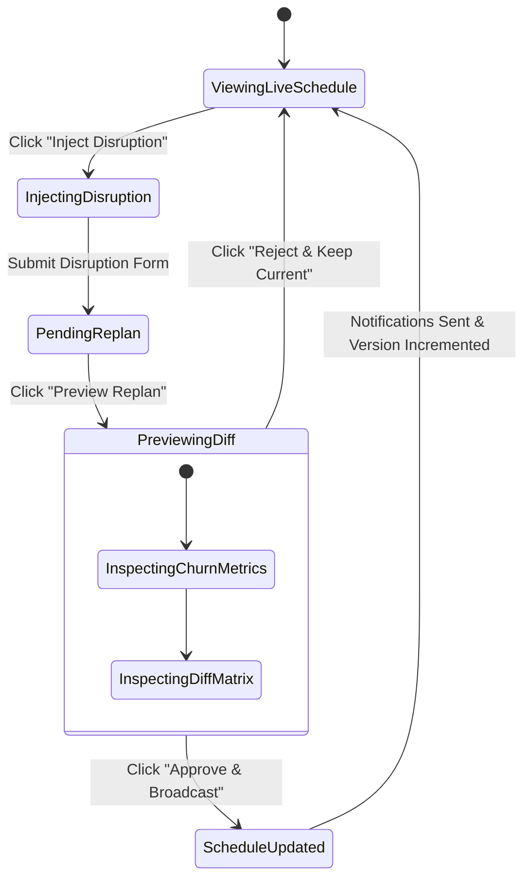

# Coordinator Dashboard UI/UX Specification

> **Document Version:** 1.0.0  
> **Status:** Approved Source of Truth  
> **Target Audience:** Placement Coordinator under High-Stress Placement Week Operations

---

## 1. UX Design Philosophy: The 3-Second Insight Guarantee

During campus placement week, a placement coordinator manages 800 students and 35 corporate teams amidst intense time pressure. When a disruption hits, the UI must **never confuse or overwhelm** the user with unnecessary visual clutter.

### Core UX Principles
1. **The 3-Second Insight Guarantee:** Within 3 seconds of looking at the screen, the coordinator must immediately identify:
   - Current operational state (Green = Normal, Yellow = Pending Replan, Red = Active Conflict).
   - Key metrics (Room Utilization, Clash Rate, Active Disruption alert).
   - High-priority actions required.
2. **Visual Hierarchy First:** Master Gantt/Timeline occupies $70\%$ of screen real estate. Sidebars handle controls and metrics.
3. **No Unintended Commits:** Every disruption replan is rendered in a **Side-by-Side Diff Preview Modal** with explicit `Approve` (Green) and `Reject` (Red) actions.

---

## 2. Dashboard Layout & Component Architecture

```
+---------------------------------------------------------------------------------------------------+
|  [MIRAI LABS] Placement Coordinator Dashboard  | Day: [ 1 | 2 | 3 | 4 ] | [⚡ INJECT DISRUPTION] |
+---------------------------------------------------------------------------------------------------+
| METRICS BAR:                                                                                      |
|  [ Room Util: 78.4% ]  [ Student Clash Rate: 0.0% ]  [ Avg Wait: 0.85h ]  [ Coverage: 89.2% ]     |
+-------------------------------------------------------------+-------------------------------------+
| MASTER GANTT TIMELINE GRID (20 Rooms x Operating Hours)     | DISRUPTION & CONFLICT DRAWER        |
|                                                             |                                     |
| Time Slot  | Room 01 (Lab A) | Room 02 (Lab B) | Room 03... | 🔴 ACTIVE DISRUPTIONS               |
|------------+-----------------+-----------------+------------|  • TechCorp (3h Late, Day 1)        |
| 09:00-09:45| [TechCorp: S102]| [DataSoft: S301]| [FREE]     |  • Room 05 AC Failure (10:00-14:00) |
| 09:45-10:30| [TechCorp: S104]| [DataSoft: S305]| [FREE]     |                                     |
| 10:30-11:15| [CloudSys: S201]| [FREE]          | [Innovate] | ⚠️ UNSCHEDULED LOGS (346)           |
| 11:15-12:00| [CloudSys: S208]| [FREE]          | [Innovate] |  • S402: STUDENT_TIME_CLASH         |
| 12:00-12:45| [LUNCH BREAK - ALL ROOMS PAUSED]             |  • S512: ROOM_EXHAUSTED             |
| 12:45-13:30| [TechCorp: S110]| [DataSoft: S310]| [NetSol]   |                                     |
| 13:30-14:15| [TechCorp: S112]| [DataSoft: S312]| [NetSol]   | [⚡ PREVIEW REPLAN PROPOSAL]        |
+-------------------------------------------------------------+-------------------------------------+
```

---

## 3. UI Components Breakdown

### 3.1 Top Header & Global Status Bar
- **Day Selector:** Segmented control for switching between Placement Days 1, 2, 3, and 4.
- **Global Status Badge:**
  - `🟢 SCHEDULE STABLE`: Zero active disruptions pending.
  - `🟡 REPLAN REQUIRED`: Disruption injected; preview ready.
  - `🔴 SYSTEM ALERT`: Hard constraint conflict detected.
- **Action Button:** `[⚡ Inject Disruption]` triggers modal for company delay, panel drop, student withdrawal, or room downtime.

### 3.2 Live Metrics Cards Bar
Four high-contrast KPI cards positioned at top-of-mind:
1. **Room Utilization:** Displays current percentage (e.g. $78.4\%$) with progress bar.
2. **Student Clash Rate:** Highlighted in bold green ($0.0\%$). Flashes bright red if $> 0.0\%$.
3. **Avg Student Waiting Time:** Displays average gap hours ($0.85\text{ hrs}$).
4. **Schedule Coverage:** Percentage of scheduled interviews ($89.2\%$).

### 3.3 Master Gantt / Timeline Grid
- **Columns:** 20 Rooms (Room 01 to Room 20).
- **Rows:** 15-minute discretized time slots from 09:00 to 18:00.
- **Color-Coded Interview Block Pill Components:**
  - **Blue Pills:** Tier 1 Companies.
  - **Purple Pills:** Tier 2 Companies.
  - **Teal Pills:** Tier 3 Mass Recruiters.
  - **Grey Hatch Pattern:** Disabled Room / Recruiter Late Arrival.
  - **Red Alert Border:** Impacted interview requiring replan.
- **Interactive Tooltips:** Hovering over an interview pill displays: Student Name, CGPA, Branch, Company, Panel Name, Exact Duration, and Contact Number.

### 3.4 Disruption & Conflict Drawer (Right Sidebar)
- **Active Disruptions List:** Shows registered disruptions with timestamp and blast radius count.
- **Conflict Diagnostic Log:** Collapsible accordion listing unassigned students and exact failure reasons (`STUDENT_TIME_CLASH`, `ROOM_EXHAUSTED`, `CGPA_INELIGIBLE`).
- **Primary CTA:** `[⚡ Preview Replan Proposal]` executes local repair preview.

---

## 4. Replan Preview & Side-by-Side Diff Modal

When the coordinator clicks **Preview Replan Proposal**, a high-impact modal overlays the dashboard before any live changes are committed:

```
+---------------------------------------------------------------------------------------------------+
|  REPLAN PROPOSAL PREVIEW — Disruption: TechCorp 3h Late (Day 1)                                   |
+---------------------------------------------------------------------------------------------------+
| CHURN SUMMARY:                                                                                    |
|  • Replan Churn Index: 4.2% (LOW)                                                                |
|  • Affected Students: 24  |  Unchanged Interviews: 2,830  |  Moved: 24  |  Cancelled: 0            |
+---------------------------------------------------------------------------------------------------+
| SCHEDULE DIFF MATRIX:                                                                             |
|                                                                                                   |
| Student        | Company  | Action   | Original Slot       | Proposed Slot       | Room Shift   |
|----------------+----------+----------+---------------------+---------------------+--------------|
| Rahul Sharma   | TechCorp | 🟡 MOVED | Day 1, 09:00-09:45  | Day 1, 12:00-12:45  | Room 02 (Same|
| Priya Patel    | TechCorp | 🟡 MOVED | Day 1, 09:45-10:30  | Day 1, 12:45-13:30  | R02 -> R05   |
| Amit Verma     | DataSoft | 🟡 MOVED | Day 1, 11:00-11:45  | Day 1, 11:00-11:45  | R08 -> R12   |
| Ananya Roy     | CloudSys | 🔴 CANCEL| Day 1, 14:00-14:45  | [WITHDRAWN]         | -            |
+---------------------------------------------------------------------------------------------------+
|  [❌ REJECT & KEEP CURRENT]                                 [🟢 APPROVE & BROADCAST REPLAN]       |
+---------------------------------------------------------------------------------------------------+
```

---

## 5. Coordinator Interaction Workflows


