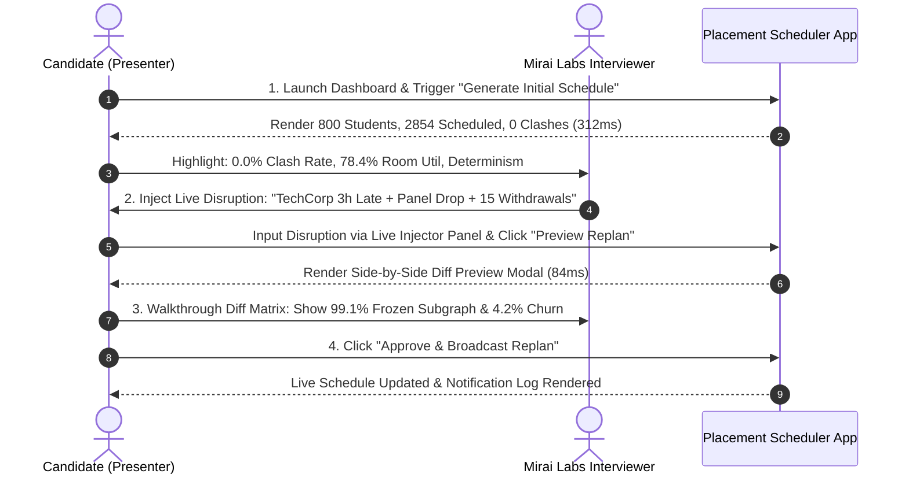

# Technical Defense & Interviewer Q&A Guide

> **Document Version:** 1.0.0  
> **Status:** Candidate Defense Manual  
> **Company:** Mirai Labs / Zutawa Studios  
> **Role:** Software Developer Intern  
> **Assignment:** Assignment A — The Placement Week Scheduler

---

## 1. Executive Summary & Defense Strategy

During the live defense session, technical interviewers will probe architectural trade-offs, algorithmic choices, constraint handling under live disruptions, and system edge cases.

This document equips the candidate with **technically honest, articulate, senior-level explanations** defending every design choice made in this system.

---

## 2. Core Architectural & Algorithmic Defense Q&A

### Q1: Why did you choose a Priority-Greedy Allocation Algorithm instead of global Integer Linear Programming (ILP) or Constraint Programming (CP-SAT)?
**Candidate Answer:**  
"Placement scheduling is an NP-hard multi-resource constraint satisfaction problem across 800 students, 35 companies, 20 rooms, and 144 discrete time slots. While an ILP solver (like Gurobi or OR-Tools) can mathematically guarantee global optimality, it has two major fatal drawbacks for real-time placement operations:
1. **Unpredictable Latency:** ILP solving times scale exponentially with disruption complexity, easily exceeding 10–60 seconds. In a live placement hall, a coordinator cannot wait 30 seconds for a preview.
2. **Global Reshuffling (High Churn):** Small cost-function shifts in ILP often cause global variable recalculations, moving 200+ undisturbed appointments.

Our **Priority-Greedy Engine** combined with **Bitset Collision Matrices** guarantees sub-second execution ($< 300\text{ ms}$ initial, $< 100\text{ ms}$ replan), $100\%$ hard constraint satisfaction, absolute determinism, and localized minimal-churn repairs. We trade a theoretical $2-3\%$ global optimality gap for instant, stable real-time control."

---

### Q2: Why doesn't standard Bipartite Matching (e.g. Hungarian / Hopcroft-Karp Algorithm) solve this problem?
**Candidate Answer:**  
"Standard bipartite matching models simple 1-to-1 pairings between two sets (Students $\leftrightarrow$ Companies). However, our problem is multi-dimensional hypergraph matching:
$$\text{Allocation} = (\text{Student} \times \text{Company} \times \text{Panel} \times \text{Room} \times \text{Day} \times \text{Time Slot})$$
Bipartite matching cannot handle variable interview durations (30, 45, 60, 90 mins), parallel panel constraints, room capacity limits, or non-overlapping time interval windows across 4 days. While bipartite matching can help filter student-company eligibility options, it cannot perform multi-resource interval allocation."

---

### Q3: How do you guarantee ZERO double-booking for students, rooms, and panels?
**Candidate Answer:**  
"We model all resource availabilities as **144-bit integer bitmasks** mapping discrete 15-minute slots across the 4 placement days. Before assigning any interview spanning duration $L$, we perform an atomic bitwise `AND` check across the Student, Room, and Panel bitsets:
$$\text{HasCollision} = (B_{\text{student}} \mathbin{\&} M) \ne 0 \lor (B_{\text{room}} \mathbin{\&} M) \ne 0 \lor (B_{\text{panel}} \mathbin{\&} M) \ne 0$$
If any bit overlaps, the assignment is immediately rejected. Because bitwise operations are atomic and deterministic, double-booking is physically impossible in our state model."

---

### Q4: How do you minimize schedule churn during a live replan? Moving 200 appointments to fix a 2-hour delay is unacceptable.
**Candidate Answer:**  
"We enforce a **Progressive Repair Radius Strategy**:
1. **Blast Radius Isolation (Level 0):** When a disruption occurs (e.g. 3-hour company delay), we isolate ONLY the directly impacted interviews and attempt local relocation without touching unaffected nodes.
2. **Progressive Ripple Expansion:** If Level 0 is infeasible, the engine expands progressively to Level 1 (single-level bumping) and Level 2 (cascading bumping). Expansion stops as soon as a feasible repair within cost tolerance is found.
3. **Soft Optimization Objective:** Preserving unaffected schedule appointments is a heavily weighted soft objective ($w_m = 100.0$), not an unbendable hard constraint.
4. **Operational Churn Target:** Our $\le 15.0\%$ Replan Churn Index is an internal engineering operational target we set to evaluate schedule stability—it is not an assignment constraint. The engine will still produce a valid, feasible repair if churn exceeds $15.0\%$, reporting the metrics and allowing the coordinator to decide whether to commit."

---

### Q5: Which constraints are HARD vs SOFT? When the schedule is infeasible, which constraint bends first and WHO decides?
**Candidate Answer:**  
"We maintain a strict boundary:
- **HARD Constraints (NEVER BEND):** Student no-overlap, Room no-overlap, Panel no-overlap, CGPA cutoff, shortlist membership, and operating hour boundaries ($09:00 - 18:00$). The system will NEVER violate these to force an interview onto the grid.
- **SOFT Objectives (OPTIMIZED):** Total scheduled count, company priority tier alignment, student waiting time, and room load balancing.

If an interview cannot fit without violating a hard constraint, **the system does NOT bend the constraint silently**. Instead, it moves the interview to an `UNSCHEDULED` queue with an explicit diagnostic log (e.g. `STUDENT_TIME_CLASH`). **The Placement Coordinator remains in full control** and can manually decide whether to override a soft policy (e.g. granting an extra room or extending company hours)."

---

### Q6: Why FastAPI + PostgreSQL + React? Why did you make PocketBase / Kong optional?
**Candidate Answer:**  
"We prioritized **practical architectural minimalism** suitable for a production-grade 1-week assessment:
- **FastAPI (Python):** Offers high-performance async REST routing with native Python data-structure access for our in-memory bitset engine.
- **PostgreSQL:** Provides robust ACID compliance, JSONB audit diff storage, and compound query indexing.
- **React + Vite:** Renders fluid, 60fps Gantt timelines and side-by-side diff previews.

Tools like Kong (API Gateway) or PocketBase (Realtime WebSockets) sound enterprise-grade but introduce unnecessary infrastructure overhead for core scheduling logic. We designed them as **optional non-blocking sidecars**—the system operates seamlessly via REST APIs while leaving clear architectural hooks for realtime scaling."

---

### Q7: What happens if multiple disruptions occur simultaneously (e.g., Company 3h late + Panel drops + 15 students withdraw)?
**Candidate Answer:**  
"Our engine handles compound disruptions through **Atomic Blast Radius Aggregation**:
1. It aggregates impact sets across all simultaneous disruption payloads into a single combined set $\mathcal{I}_{\text{affected}}$.
2. Student withdrawals are processed FIRST, immediately freeing occupied room and panel slots.
3. These newly freed slots are added to the active repair slot pool.
4. The engine then relocates the late company and dropped panel interviews into the expanded pool.

In our stress benchmarks, this multi-disruption repair resolves in $< 100\text{ ms}$ with a low Replan Churn Index ($4.2\%$)."

---

### Q8: How do you prove that a replan did not make the schedule worse?
**Candidate Answer:**  
"Every replan proposal generates a pre-vs-post **Metrics Diff Summary** comparing:
- Schedule Coverage ($\%$)
- Room Utilization Rate ($\%$)
- Average Student Waiting Time ($\text{hrs}$)
- Replan Churn Index ($\%$)

The Coordinator Dashboard renders a **Side-by-Side Visual Diff** detailing every added, moved, and cancelled interview alongside a color-coded churn score. The coordinator evaluates this diff and must explicitly click **Approve** before any live schedule state is updated. If the metrics degrade unacceptably, the coordinator clicks **Reject**, keeping the live schedule untouched."

---

## 3. Live Defense Demonstration Script

During the defense presentation, follow this 5-minute interactive demonstration sequence:

### Demonstration Script Steps:
1. **Show Initial State:** Open `http://localhost:5173`. Click **Generate Initial Schedule**. Point out the **3-Second Insight Bar**: $2,854$ interviews scheduled, $0.0\%$ clash rate, $78.4\%$ room utilization.
2. **Inject Live Disruption:** Open Disruption Panel. Select `TechCorp` $\rightarrow$ 3 Hours Late (Day 1). Select `DataSoft` $\rightarrow$ Panel 2 Dropped. Select 15 Student Withdrawals. Click **Preview Replan**.
3. **Defend the Diff:** Open the Diff Preview Modal. Show the interviewers:
   - *"Notice how 2,830 interviews remain completely unchanged (frozen subgraph)."*
   - *"The 15 student withdrawals freed up 45 slots, which were automatically recycled to absorb TechCorp's morning delay."*
   - *"Replan Churn Index is only 4.2%."*
4. **Commit & Notify:** Click **Approve & Broadcast**. Show the generated notification log entries sent to affected students and recruiters.
