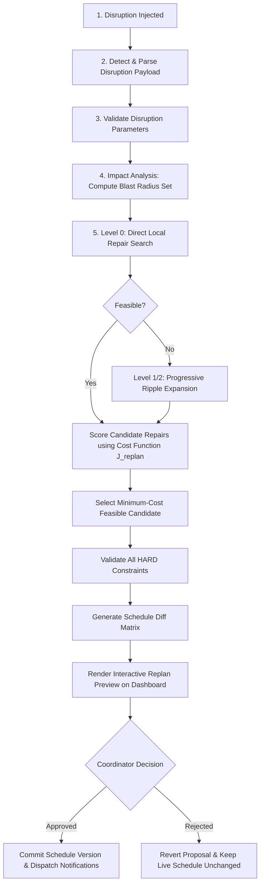
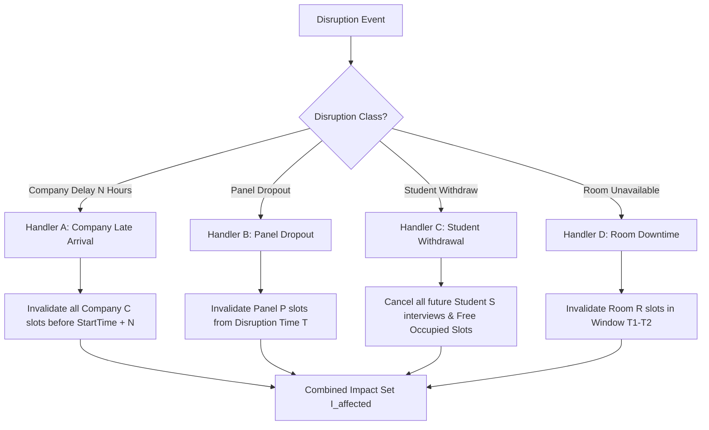
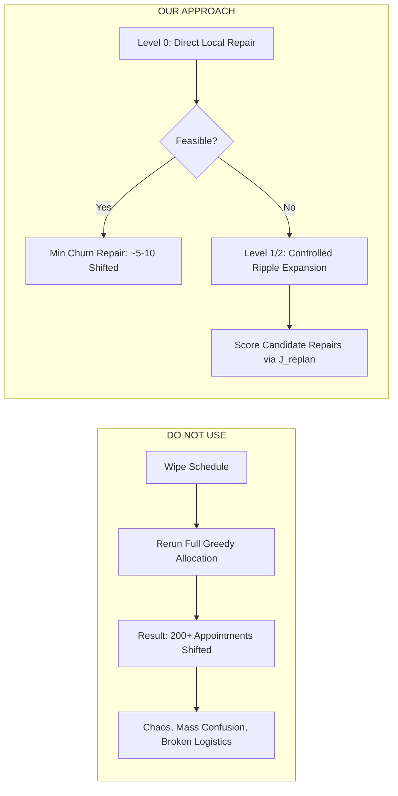
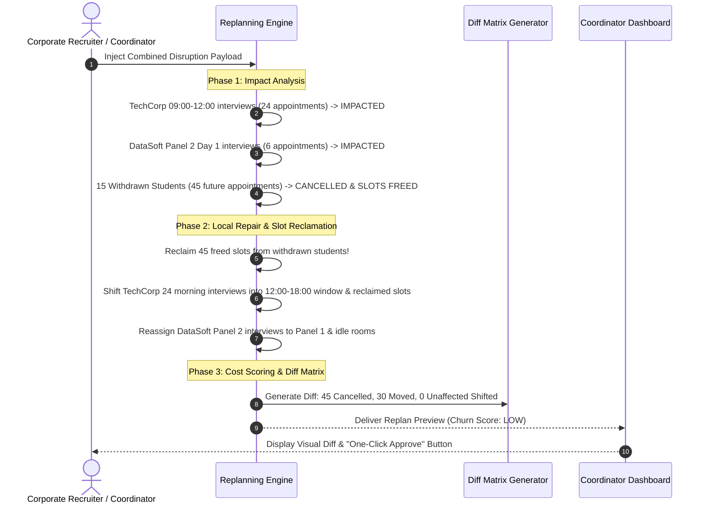

# Real-Time Replanning Engine & Local Repair Specification

> **Document Version:** 1.0.0  
> **Status:** Approved Source of Truth  
> **Module:** Core Replanning & Minimal Churn Engine  
> **Importance:** Primary Core Feature of Technical Assessment

---

## 1. Overview & Replanning Philosophy

Real-time disruptions during campus placement week are inevitable: corporate recruiters get stuck in transit, interview panelists fall ill, students withdraw after securing job offers, and air conditioning or electrical failures render interview rooms unusable.

A naive replanning engine would rerun global optimization across the entire 4-day schedule. However, **moving 200 undisturbed student appointments to fix a 2-hour delay is a practical nightmare**. It creates mass panic, breaks printed student schedules, and degrades recruiter trust.

The **Placement Scheduler Replanning Engine** enforces a **Progressive Repair Radius Strategy**:
1. **Blast Radius Isolation (Level 0):** Identify directly impacted interviews and attempt targeted local relocation into open or freed time slots without touching surrounding interviews.
2. **Progressive Ripple Expansion:**
   - **Level 0 (Direct Repair):** Re-allocate impacted interviews directly into free slots.
   - **Level 1 (Depth-1 Ripple):** If Level 0 is infeasible, allow single-level bumping of non-critical neighbor interviews into open slots.
   - **Level 2 (Depth-2 Ripple):** If Level 1 is infeasible, allow multi-level cascading bumping.
   - **Progressive Region Expansion:** Expand the search radius only as far as necessary to restore feasibility.
3. **Stopping Criteria:** Radius expansion stops immediately when:
   - A feasible repair is found within an acceptable cost score, OR
   - Additional schedule changes become disproportionately expensive relative to dropping an interview, OR
   - Search depth exceeds max depth limit $K$.
4. **Optimization vs Hard Constraint:** Preserving unaffected schedule nodes is a heavily weighted **SOFT OPTIMIZATION OBJECTIVE**, NOT an absolute hard constraint. The algorithm prefers minimal movement, but will expand repair boundaries when severe disruptions require it.
5. **Operational Churn Target:** The $\le 15.0\%$ Replan Churn Index is an **internal engineering performance benchmark** selected by the team to evaluate repair stability. It is **NOT** a rigid assignment requirement or mathematical feasibility threshold. A replan with $> 15.0\%$ churn remains $100\%$ valid, feasible, and actionable; the system will report the churn metric, explain the cause, and allow the coordinator to review and decide whether to commit.

---

## 2. Complete 13-Step Replanning Lifecycle



---

## 3. Disruption-Specific Impact Analysis Handlers

The system implements 4 specialized impact analyzers to compute the minimal set of affected interviews $\mathcal{I}_{\text{affected}}$:



### Handler A: Company Late Arrival ($N$ Hours on Day $D$)
- **Condition:** Company $C$ arrives $N$ hours late on Day $D$ (e.g. 3 hours late $\implies$ operating window opens at 12:00 instead of 09:00).
- **Direct Impact:** All interviews $i$ where $i.company = C \land i.day = D \land i.start\_time < (09:00 + N)$ are marked `IMPACTED`.
- **Action:** Evict direct impact interviews. Unaffected company interviews scheduled after $(09:00 + N)$ remain untouched initially.

### Handler B: Panel Dropout
- **Condition:** Panel $P$ of Company $C$ drops out starting at Time $T$ on Day $D$.
- **Direct Impact:** All interviews $i$ where $i.panel = P \land i.day = D \land i.start\_time \ge T$ are marked `IMPACTED`.
- **Action:** Evict direct impact interviews. Attempt to reallocate to idle panels of Company $C$ in parallel rooms before shifting time slots.

### Handler C: Student Withdrawal
- **Condition:** Student $S$ accepts another offer and withdraws from all remaining interviews.
- **Direct Impact:** All interviews $i$ where $i.student = S \land i.status = \text{'SCHEDULED'} \land i.start\_time \ge T_{\text{current}}$ are marked `CANCELLED`.
- **Action:** Immediately release occupied room, panel, and student time slots. Add freed slots to the **Repair Slot Pool** to help relocate other bumped interviews!

### Handler D: Room Unavailability
- **Condition:** Room $R$ is disabled between $[T_1, T_2]$ on Day $D$ (e.g. AC failure).
- **Direct Impact:** All interviews $i$ where $i.room = R \land i.day = D \land (i.end\_time > T_1 \land i.start\_time < T_2)$ are marked `IMPACTED`.
- **Action:** Keep time slot and panel assignments unchanged if possible; attempt to move room allocation to an idle parallel room $R' \in ActiveRooms$.

---

## 4. Conceptual Repair-Cost Function

To select the best candidate repair proposal, the engine computes a comprehensive **Repair Cost Score** $J_{\text{replan}}(S_{\text{candidate}})$. The candidate with the **lowest total cost score** is selected.

$$J_{\text{replan}} = w_m \cdot N_{\text{moved}} + w_w \cdot \Delta \text{WaitTime} + w_p \cdot \Delta \text{PriorityLost} + w_r \cdot N_{\text{room\_changed}} + w_{\text{panel}} \cdot N_{\text{panel\_changed}} + w_u \cdot N_{\text{unscheduled}}$$

### Parameter Definitions & Default Configurable Weights

| Variable | Description | Default Weight ($w$) | Operational Meaning |
| :--- | :--- | :--- | :--- |
| $N_{\text{moved}}$ | Total interviews whose time slot or day was shifted | $w_m = 100.0$ | **Primary Churn Penalty:** Moving time slots inconveniences students and recruiters. |
| $\Delta \text{WaitTime}$ | Increase in total student idle waiting gap hours | $w_w = 10.0$ | Penalizes introducing long, awkward gaps in student schedules. |
| $\Delta \text{PriorityLost}$| Loss in high-priority company interview allocations | $w_p = 50.0$ | Heavily penalizes dropping or delaying Tier 1 company interviews. |
| $N_{\text{room\_changed}}$| Interviews kept in same time slot but moved to a new room | $w_r = 5.0$ | **Low Churn Penalty:** Changing rooms in the same building is easy to navigate. |
| $N_{\text{panel\_changed}}$| Interviews kept in same time slot but reassigned panel | $w_{\text{panel}} = 2.0$ | **Minimal Penalty:** Swapping panels within the same company. |
| $N_{\text{unscheduled}}$| Interviews that could not be repaired and were dropped | $w_u = 1000.0$ | **Severe Penalty:** Unscheduling an interview is the absolute last resort. |

> [!NOTE]
> All weight parameters $w_m, w_w, w_p, w_r, w_{\text{panel}}, w_u$ are fully configurable via the API/Dashboard and are NOT hardcoded magic numbers.

---

## 5. Rationale: Progressive Repair Radius vs. Naive Reshuffling



---

## 6. Replanning Algorithm Pseudocode

```python
def execute_local_repair(current_schedule, disruption, max_ripple_depth=2):
    # Step 1: Impact Analysis
    affected_interviews, freed_slots = analyze_disruption_impact(current_schedule, disruption)
    
    # Step 2: Freeze Unaffected Subgraph
    unaffected_schedule = [i for i in current_schedule if i not in affected_interviews]
    bitsets = build_bitsets_from_schedule(unaffected_schedule)
    
    # Step 3: Ripple Repair Search
    candidate_repairs = []
    
    # Attempt Primary Local Relocation (Depth 0: Move affected into open slots)
    unresolved, partial_repair = allocate_interviews_greedy(affected_interviews, bitsets)
    
    if not unresolved:
        candidate_repairs.append(partial_repair)
    else:
        # Depth > 0: Ripple Bumping (Evict low-priority neighbor to free slot for high-priority affected)
        for depth in range(1, max_ripple_depth + 1):
            bumped_repair = ripple_bump_search(unresolved, bitsets, depth)
            candidate_repairs.append(bumped_repair)

    # Step 4: Cost Scoring
    scored_candidates = []
    for repair in candidate_repairs:
        cost = compute_repair_cost(
            base_schedule=current_schedule,
            repaired_schedule=repair,
            weights=CONFIGURABLE_REPLAN_WEIGHTS
        )
        scored_candidates.append((cost, repair))

    # Select repair with minimum cost
    scored_candidates.sort(key=lambda x: x[0])
    best_cost, best_repaired_schedule = scored_candidates[0]

    # Step 5: Diff Generation
    diff_matrix = generate_schedule_diff(current_schedule, best_repaired_schedule)

    return ReplanProposal(
        disruption=disruption,
        proposed_schedule=best_repaired_schedule,
        diff_matrix=diff_matrix,
        repair_cost=best_cost
    )
```

---

## 7. Time & Space Complexity Analysis

### Time Complexity
- **Impact Analysis:** $O(N_{\text{total\_interviews}})$, where $N \le 3200$. Scans schedule once to flag direct conflicts ($\approx 1\text{ ms}$).
- **Local Ripple Repair:** Searches open slots for $A$ affected interviews ($A \ll N$, typically $A \in [5, 50]$).
  - Slot evaluation per affected interview: $O(144 \cdot P \cdot R)$ bitwise checks.
  - Ripple bumping search with depth $K=2$: $O(A \cdot 144 \cdot P \cdot R \cdot K)$.
- **Cost Function & Diff Evaluation:** $O(N_{\text{total\_interviews}})$ comparison.
- **Total Replanning Execution Time:** $O(A \cdot 144 \cdot P \cdot R \cdot K + N) \implies \mathbf{< 100 \text{ ms}}$, easily satisfying the $1.5\text{-second}$ requirement.

### Space Complexity
- **Bitset & State Duplication:** Requires cloning current bitset occupancy arrays ($16.5\text{ KB}$) and candidate schedule lists ($\approx 500\text{ KB}$).
- **Total Space Complexity:** $\mathbf{O(N)} \approx \mathbf{2 \text{ MB}}$ memory allocation per candidate preview.

---

## 8. Concrete Walkthrough: Live Defense Scenario

### Scenario Setup (The Ultimate Stress Test):
On **Day 1 at 09:00**, three major disruptions occur simultaneously:
1. **Company Delay:** `TechCorp` (Day 1 Mass Recruiter, 120 shortlisted students, 4 panels) arrives **3 hours late** (can only start interviews at 12:00).
2. **Panel Dropout:** `DataSoft` (Tier 2 Company) loses **Panel 2** for the entire day.
3. **Student Withdrawals:** **15 high-performing students** withdraw mid-day after receiving off-campus FAANG offers.



### Detailed Schedule Diff Output Matrix

| Interview ID | Student Name | Company | Old Time Slot | New Time Slot | Old Room | New Room | Status | Churn Type |
| :--- | :--- | :--- | :--- | :--- | :--- | :--- | :--- | :--- |
| `INT-1042` | Rahul Sharma | TechCorp | Day 1, 09:15 | Day 1, 12:15 | Room 02 | Room 02 | `MOVED` | Time Shift (3h Late) |
| `INT-1045` | Priya Patel | TechCorp | Day 1, 10:00 | Day 1, 13:00 | Room 02 | Room 05 | `MOVED` | Time & Room Shift |
| `INT-2088` | Amit Verma | DataSoft | Day 1, 11:00 | Day 1, 11:00 | Room 08 | Room 12 | `MOVED` | Room Swap Only |
| `INT-3012` | Ananya Roy | CloudSys | Day 1, 14:00 | - | Room 04 | - | `CANCELLED` | Student Withdrawn |
| `INT-4099` | Vikram Singh| Innovate | Day 2, 10:00 | Day 2, 10:00 | Room 01 | Room 01 | `UNCHANGED` | Frozen Subgraph |

### Replan Notification Payload Generation
Once approved, the system generates targeted SMS/Email alerts:
- **To Student (Rahul Sharma):** *"UPDATED: Your TechCorp interview on Day 1 has been rescheduled to 12:15 in Room 02 due to recruiter late arrival."*
- **To Recruiter (TechCorp):** *"SCHEDULE REPAIRED: All 24 morning interviews successfully shifted into your updated 12:00-18:00 window."*
