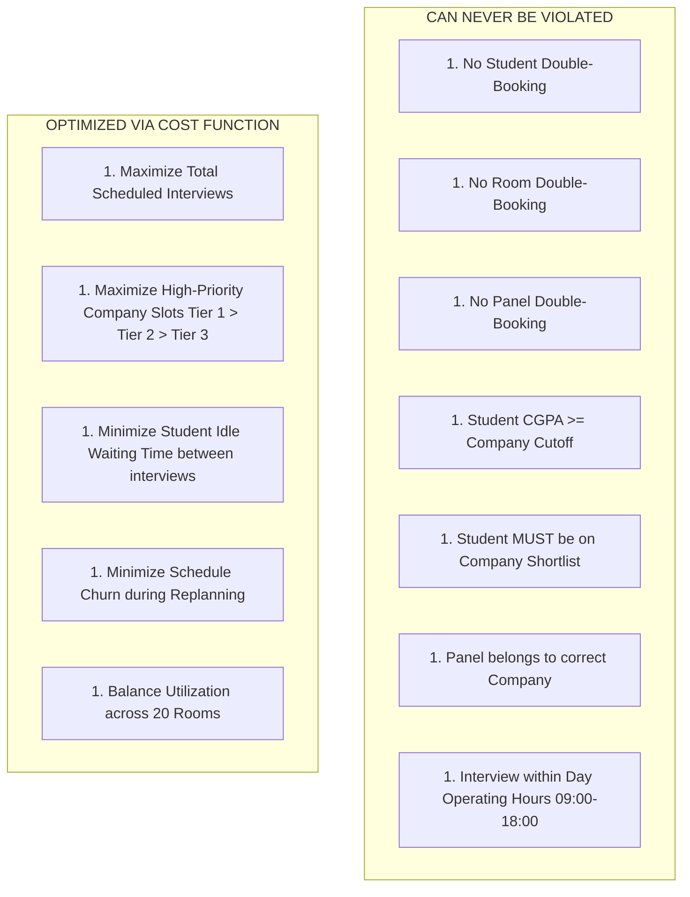
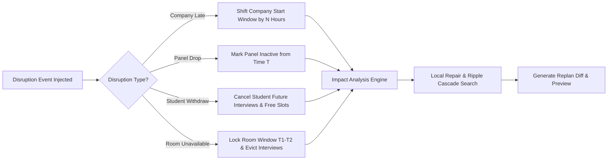

# System Requirements Specification

> **Document Version:** 1.0.0  
> **Status:** Approved Source of Truth  
> **Target System:** The Placement Week Scheduler (Placement Operations System)

---

## 1. Introduction & Context

Campus placement week at a major engineering institution involves extreme resource competition. Over **4 consecutive days**, **35 companies** conduct multi-stage interviews for **800 eligible engineering students** across **20 dedicated interview rooms**.

Because premier students are shortlisted by 5–15 companies simultaneously and companies enforce rigid panel availabilities, time-slot overlap is guaranteed. Furthermore, real-world disruptions (delayed corporate arrivals, missing panelists, student withdrawals post-job offer, room power outages) routinely break static schedules.

This document defines the formal functional, non-functional, constraint, disruption, dashboard, and acceptance requirements for **The Placement Week Scheduler**.

---

## 2. Functional Requirements (FR)

### FR-1: Realistic Placement Dataset Generator
- **FR-1.1:** The system MUST generate a synthetic but statistically realistic dataset containing exactly **35 companies**, **800 students**, **20 interview rooms**, and **4 placement days** (Day 1 to Day 4).
- **FR-1.2:** **Student Attributes:** Each student MUST have a unique ID, name, CGPA ($0.00 - 10.00$), branch (e.g., CSE, ECE, MECH, CIVIL, EEE), and shortlist memberships.
- **FR-1.3:** **CGPA Distribution:** CGPA values MUST follow a realistic right-skewed normal distribution ($\mu=7.8, \sigma=1.1$, clamped between $5.00$ and $10.00$).
- **FR-1.4:** **Company Attributes:** Each company MUST have a priority tier (Tier 1: High-paying/Niche, Tier 2: Mid-tier Product, Tier 3: Mass Recruiter), CGPA cutoff ($6.00 - 8.50$), panel count ($1 - 5$ panels), interview duration ($30, 45, 60,$ or $90$ minutes), and total required interview slots.
- **FR-1.5:** **Shortlist Realism:** Top-tier students ($\text{CGPA} \ge 8.5$) MUST appear on $5 - 12$ company shortlists. Mass recruiters on Day 1 MUST shortlist $200 - 400$ eligible students.
- **FR-1.6:** **Resource Availability:** Operating hours are strictly $09:00$ to $18:00$ daily ($9$ hours/day = $36$ total operating hours per room across 4 days).

### FR-2: Feasible Initial Schedule Generation
- **FR-2.1:** The system MUST allocate interviews into discrete time slots assigning: `(Student, Company, Room, Panel, Day, Start Time, End Time)`.
- **FR-2.2:** The scheduler MUST be **deterministic**: running the generator on identical inputs MUST yield the exact same schedule.
- **FR-2.3:** The scheduler MUST maximize total scheduled interviews while strictly adhering to all HARD constraints.
- **FR-2.4:** The system MUST **never fail silently**. If an interview cannot be scheduled, it MUST log an explicit unassigned interview record with a human-readable conflict reason (e.g., `STUDENT_TIME_CLASH`, `NO_ROOM_AVAILABLE`, `PANEL_EXHAUSTED`, `CGPA_INELIGIBLE`, `COMPANY_WINDOW_CLOSED`).

### FR-3: Real-Time Replanning Engine
- **FR-3.1:** The system MUST support four primary real-world disruption events injected at any time $T$ during placement week:
  1. **Company Late Arrival:** Company $C$ arrives $N$ hours late on Day $D$.
  2. **Panel Dropout:** Panel $P$ of Company $C$ becomes unavailable starting at Day $D$, Time $T$.
  3. **Student Withdrawal:** Student $S$ withdraws from all remaining interviews (e.g., accepted an off-campus or early offer).
  4. **Room Unavailability:** Room $R$ becomes unusable for a time window $[T_1, T_2]$ on Day $D$.
- **FR-3.2:** **Local Repair Priority:** Replanning MUST freeze all unaffected interviews. It MUST first attempt local repair (re-assigning affected interviews to open slots or swapping with minimal-impact neighbors) before performing global reshuffling.
- **FR-3.3:** **Schedule Churn Minimization:** The replanning engine MUST penalize moving previously scheduled, unaffected interviews.
- **FR-3.4:** **Preview & Diff Generation:** The system MUST generate a structured **Replan Diff** (Added, Cancelled, Shifted, Unscheduled) and allow the placement coordinator to preview and score the diff BEFORE committing changes.
- **FR-3.5:** **Notification Roster Generation:** Upon commitment, the system MUST construct targeted notification payloads for affected students, recruiters, and panel members.

### FR-4: Metrics & Operational Analytics
- **FR-4.1:** The system MUST continuously compute and expose 10 operational metrics before and after initial scheduling and replanning.
- **FR-4.2:** Metrics include: Room Utilization Rate (RUR), Student Clash Rate (SCR), Average Student Waiting Time (AWT), Replan Churn Index (RCI), Schedule Coverage (SC), Total Scheduled Interviews, Total Unscheduled Interviews, Affected Students Count, Unchanged Interviews Count, and Moved Interviews Count.

### FR-5: Coordinator Dashboard Interface
- **FR-5.1:** The system MUST provide an interactive web dashboard for the placement coordinator.
- **FR-5.2:** Features MUST include: Master Gantt/Timeline view across 20 rooms and 4 days, interactive disruption trigger panel, side-by-side replan diff modal, conflict drawer, and one-click commit/rollback actions.

---

## 3. Non-Functional Requirements (NFR)

- **NFR-1 (Performance & Speed):** Initial schedule generation for 800 students, 35 companies, and 20 rooms MUST execute in under **$3.0$ seconds**.
- **NFR-2 (Replanning Latency):** Local repair replanning under any single disruption event MUST complete and render a diff preview in under **$1.5$ seconds**.
- **NFR-3 (Determinism):** Given the same initial state and disruption input, the replanning algorithm MUST generate the exact same repair proposal.
- **NFR-4 (Auditability & Immutability):** Every schedule state change MUST be recorded as an immutable `ScheduleVersion` with full historical diff tracking.
- **NFR-5 (Usability):** The dashboard UI MUST provide a **"3-Second Insight Guarantee"**: a stressed placement coordinator MUST be able to spot severe clashes and system alerts within 3 seconds of viewing the dashboard.

---

## 4. HARD Constraints vs. SOFT Optimization Objectives

A foundational requirement of this project is the strict distinction between **HARD constraints** (which can NEVER be violated under any circumstances) and **SOFT optimization objectives** (which the algorithm attempts to maximize or minimize).

### 4.1 HARD Constraints Table
| ID | Constraint Name | Mathematical / Logical Definition | Enforced By |
| :--- | :--- | :--- | :--- |
| **HC-1** | Student No-Overlap | $\forall i, j \in \text{Interviews}, (i.student = j.student \land i.day = j.day) \implies (i.end \le j.start \lor j.end \le i.start)$ | Slot Allocator |
| **HC-2** | Room No-Overlap | $\forall i, j \in \text{Interviews}, (i.room = j.room \land i.day = j.day) \implies (i.end \le j.start \lor j.end \le i.start)$ | Slot Allocator |
| **HC-3** | Panel No-Overlap | $\forall i, j \in \text{Interviews}, (i.panel = j.panel \land i.day = j.day) \implies (i.end \le j.start \lor j.end \le i.start)$ | Slot Allocator |
| **HC-4** | CGPA Eligibility | $\forall i \in \text{Interviews}, i.student.cgpa \ge i.company.cgpa\_cutoff$ | Preprocessor |
| **HC-5** | Shortlist Validity | $\forall i \in \text{Interviews}, i.student \in i.company.shortlist$ | Preprocessor |
| **HC-6** | Panel Assignment | $\forall i \in \text{Interviews}, i.panel.company\_id = i.company.id$ | Preprocessor |
| **HC-7** | Operating Window | $\forall i \in \text{Interviews}, i.start \ge 09:00 \land i.end \le 18:00$ | Slot Allocator |
| **HC-8** | Room Availability | $\forall i \in \text{Interviews}, i.room.is\_active(i.day, i.start, i.end) = \text{True}$ | Slot Allocator |

### 4.2 SOFT Optimization Objectives Table
| ID | Objective Name | Mathematical Goal | Penalty / Weight |
| :--- | :--- | :--- | :--- |
| **SO-1** | Maximize Scheduled Count | $\max \sum_{i \in \text{Scheduled}} 1$ | $+100$ per scheduled interview |
| **SO-2** | Company Priority Weighting | $\max \sum_{i \in \text{Scheduled}} \text{PriorityWeight}(i.company.tier)$ | Tier 1: $+50$, Tier 2: $+30$, Tier 3: $+10$ |
| **SO-3** | Minimize Student Wait Time | $\min \sum_{s \in \text{Students}} \text{GapHours}(s)^2$ | $-5$ per quadratic idle hour |
| **SO-4** | Minimize Replan Churn | $\min \left( w_m N_{\text{moved}} + w_r N_{\text{room\_changed}} + w_p N_{\text{panel\_changed}} \right)$ | See [`docs/replanning-algorithm.md`](replanning-algorithm.md) |
| **SO-5** | Uniform Room Usage | $\min \text{Variance}(\text{RoomUtilization})$ | $-2$ per standard deviation unit |

---

## 5. Disruption Requirements Specification

The system MUST gracefully handle 4 disruption events without invalidating any hard constraints:

1. **Company Delay ($N$ Hours):**
   - All interviews for Company $C$ scheduled prior to $(09:00 + N)$ on Day $D$ are marked as **IMPACTED**.
   - The engine attempts to push affected interviews into open slots later on Day $D$ or Days $D+1 \dots 4$.
2. **Panel Dropout:**
   - Panel $P$ is flagged offline starting at Time $T$.
   - Interviews assigned to Panel $P$ after Time $T$ are marked as **IMPACTED**.
   - Engine attempts to reassign interviews to idle panels of Company $C$ in the same time slot, or reschedule.
3. **Student Withdrawal:**
   - Student $S$ is marked `WITHDRAWN`.
   - All future interviews for Student $S$ are **CANCELLED** immediately.
   - The freed time slots, rooms, and panels are made available to re-schedule previously unscheduled interviews.
4. **Room Unavailability:**
   - Room $R$ is disabled between $T_1$ and $T_2$ on Day $D$.
   - All interviews in Room $R$ within $[T_1, T_2]$ are marked as **IMPACTED**.
   - Engine attempts to move interviews to unused parallel rooms without changing time slots or panels.

---

## 6. Acceptance Criteria Matrix

| Feature | Scenario | Expected Behavior | Acceptance Pass/Fail Criteria |
| :--- | :--- | :--- | :--- |
| **Dataset Generator** | Generate 800 students, 35 companies, 20 rooms | Dataset created with correct CGPA skews and overlap. | **PASS:** 800 valid students, 35 companies, 0 corrupt foreign keys. |
| **Initial Scheduler** | Run scheduler on generated dataset | Feasible schedule produced; zero double bookings. | **PASS:** $0$ hard constraint violations; $100\%$ unassigned interviews logged with reason. |
| **Company Delay** | Inject 3-hour delay on Day 1 for Tier 1 Company | Interviews shifted; unaffected interviews stay frozen. | **PASS:** $0$ unaffected interviews shifted; diff correctly identifies delayed subset. |
| **Panel Dropout** | Inject panel failure mid-day | Interviews assigned to dropped panel relocated or rescheduled. | **PASS:** $0$ interviews assigned to inactive panel. |
| **Student Withdraw** | Student withdraws post-offer | Student's future interviews cancelled; slots freed up for others. | **PASS:** Student removed from schedule; freed slots re-allocated where possible. |
| **Room Unavailable** | Room 5 closed for 4 hours due to AC failure | Interviews in Room 5 relocated to idle rooms in same time slots. | **PASS:** $0$ interviews remaining in Room 5 during downtime window. |
| **Live Defense Test** | Combined disruption: 3h late company + panel drop + 15 student withdrawals | Replan executes in $< 1.5$s; minimum churn diff produced; coordinator preview rendered. | **PASS:** All hard constraints preserved, execution time $< 1.5$s, clear diff output. |
