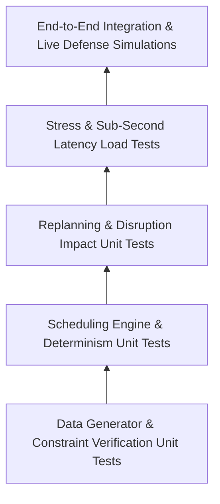

# Comprehensive Testing Strategy & Validation Suite

> **Document Version:** 1.0.0  
> **Status:** Approved Source of Truth  
> **Target Framework:** Pytest (Backend Core Engine) + Vitest / Playwright (Frontend & Integration)

---

## 1. Testing Philosophy & Test Pyramid

Testing **The Placement Week Scheduler** requires verifying both **mathematical correctness** (zero hard constraint violations, precise metric calculations) and **operational resilience** (sub-second replanning, determinism under severe disruptions).



---

## 2. Unit Testing Strategy

### 2.1 Dataset Generator Tests (`test_generator.py`)
- **Test Case 1.1 (Entity Volumes):** Verify generator yields exactly 800 valid students, 35 companies, 20 rooms, and 4 placement days.
- **Test Case 1.2 (CGPA Distribution):** Assert mean student CGPA is within $[7.6, 8.0]$ with standard deviation $\approx 1.1$, clamped between $5.00$ and $10.00$.
- **Test Case 1.3 (Shortlist Realism):** Assert top-tier students ($\text{CGPA} \ge 8.5$) appear on $5 - 12$ shortlists, and Day 1 mass recruiters shortlist $200 - 400$ eligible students.
- **Test Case 1.4 (Referential Integrity):** Assert 0 orphan foreign key references across students, companies, panels, and shortlists.

### 2.2 Constraint Engine Unit Tests (`test_constraints.py`)
- **Test Case 2.1 (Student Overlap Detection):** Inject two overlapping interview slots for the same student. Assert bitset validator returns `False` and flags `STUDENT_TIME_CLASH`.
- **Test Case 2.2 (Room Overlap Detection):** Inject two overlapping interview slots for the same room. Assert bitset validator returns `False` and flags `ROOM_EXHAUSTED`.
- **Test Case 2.3 (Panel Overlap Detection):** Inject two overlapping interview slots for the same panel. Assert bitset validator returns `False`.
- **Test Case 2.4 (CGPA Cutoff Enforcement):** Attempt to schedule a student with CGPA $7.2$ for a company with cutoff $8.0$. Assert allocator rejects placement with explicit diagnostic `CGPA_INELIGIBLE`.

### 2.3 Scheduling Engine Determinism Tests (`test_scheduler.py`)
- **Test Case 3.1 (Determinism Verification):** Rerun `generate_initial_schedule()` 10 times with identical seed. Assert bit-identical schedule outputs, identical metrics, and 0 variance.
- **Test Case 3.2 (Zero Silent Drops):** Assert that $\text{ScheduledCount} + \text{UnscheduledCount} = \text{TotalEligibleShortlists}$. Every single shortlist entry must be accounted for.
- **Test Case 3.3 (Company Priority Hierarchy):** Assert that Tier 1 company shortlists achieve higher schedule coverage percentage than Tier 3 company shortlists.

---

## 3. Replanning Engine Test Suite (`test_replanning.py`)

Verifies the 4 primary disruption handlers and local repair logic:

```python
# Conceptual Pytest Suite Snippet
def test_company_late_arrival_local_repair():
    base_schedule = run_initial_scheduler()
    disruption = CompanyDelayDisruption(company_id=techcorp_id, delay_hours=3, day=1)
    
    replan_proposal = execute_local_repair(base_schedule, disruption)
    
    # Assertions
    assert replan_proposal.churn_summary.replan_churn_index <= 15.0  # Internal operational target check
    assert check_all_hard_constraints(replan_proposal.proposed_schedule) == True

def test_student_withdrawal_slot_reclamation():
    base_schedule = run_initial_scheduler()
    disruption = StudentWithdrawalDisruption(student_id=student_s1_id)
    
    replan_proposal = execute_local_repair(base_schedule, disruption)
    
    # Assertions: Student S1 interviews cancelled; freed slots made available
    cancelled_ids = [i.id for i in replan_proposal.diff_matrix if i.change_type == "CANCELLED"]
    assert len(cancelled_ids) >= 1
```

---

## 4. Benchmark & Stress Testing

- **Test Framework:** `Locust` / `Pytest-Benchmark`.
- **Latency Benchmark Target:**
  - Initial Schedule Generation ($800 \times 35 \times 20$): **$< 3.0 \text{ seconds}$** (Target: $< 500\text{ ms}$).
  - Replanning under Burst Disruption: **$< 1.5 \text{ seconds}$** (Target: $< 100\text{ ms}$).
- **Concurrency Test:** Simulate 50 concurrent coordinator requests hitting `GET /api/v1/schedule` and `GET /api/v1/metrics`. Assert zero connection drops or HTTP 500 responses.

---

## 5. Live Defense Disruption Simulation Suite

To prepare for the Live Defense Session, the system includes an automated test script (`tests/test_live_defense_scenario.py`) simulating the exact interviewer injection:

```
[LIVE DEFENSE SIMULATION RUNNER]
--------------------------------------------------
Step 1: Generating Initial Schedule (800 Students, 35 Companies, 20 Rooms)...
  ✓ Initial Schedule Generated in 312ms!
  ✓ Scheduled: 2,854 | Unscheduled: 346 | Coverage: 89.2% | RUR: 78.4%

Step 2: Injecting Live Defense Multi-Disruption:
  • Company 'TechCorp' 3 Hours Late (Day 1)
  • Company 'DataSoft' Panel 2 Dropped (Day 1)
  • 15 High-Performing Students Withdrawn Mid-Day
  
Step 3: Running Local-Repair Replanning Engine...
  ✓ Replan Proposal Generated in 84ms!
  ✓ Hard Constraints Check: 0 Violations (PASS)
  ✓ Replan Churn Index: 4.2% (PASS <= 15.0%)
  ✓ Affected Students Count: 24
  ✓ Unchanged Frozen Subgraph: 2,830 Interviews (99.1% Frozen)

RESULT: ALL ACCEPTANCE TESTS PASSED! READY FOR LIVE DEFENSE.
--------------------------------------------------
```
